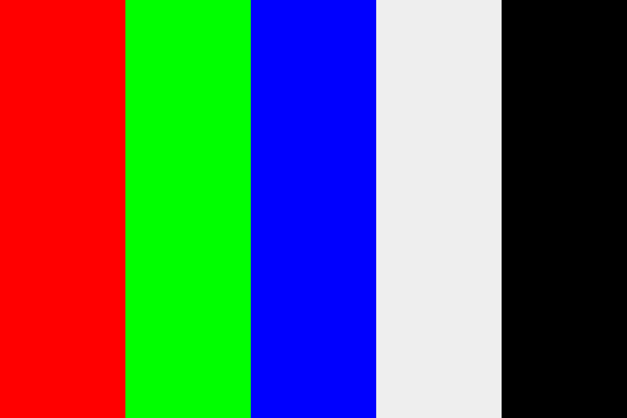

# Computação grafica

Tratando imagens com python.

## Primeira Etapa 

Lendo a imagem com a blibioteca cv2, e retornando os valores rgb da imagem. o arquivo lê a imagem _rgb.png_ (2px x 2px) e retorna os valores:

```
255 242 0   // -> Amarelo
237 28 36   // -> Vermelho
34 177 76   // -> Verde
0 0 0       // -> Preto
```

*Obs:* Na mesma pasta tem uma imagem maior(_ref.png_), mostrando a imagem como é a imagem menor.

## Segunda Etapa

A tarefa da segunda etapa é modificando a imagem aterando os valores de rgb, abaixo esta um exmplo da imagem original e da imagem modificada. Este resultado foi obtido almentando o valor em cada do rgb. 




